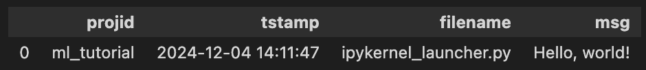
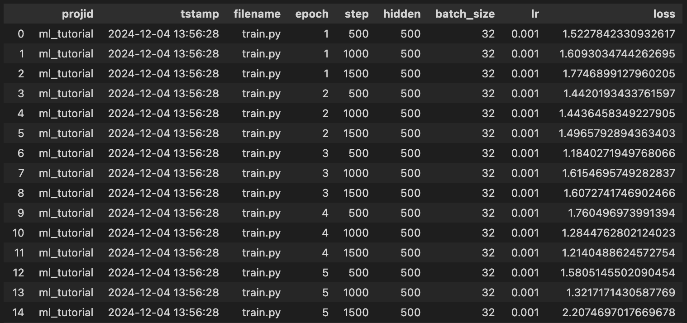
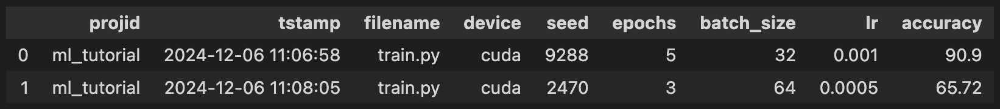
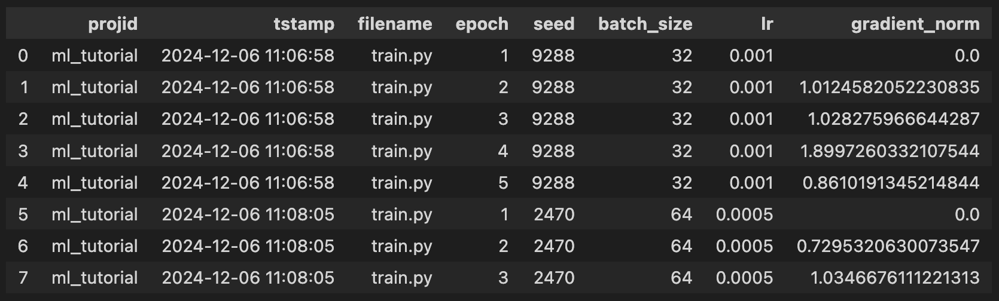

Flow with FlorDB
================================
[](https://pypi.org/project/flordb/)

FlorDB is a nimble hindsight logging database that simplifies how we manage context in the AI and machine learning lifecycle.
We center our approach on the developer-favored technique for generating metadata — log statements — leveraging the fact that logging creates context. 
FlorDB is designed to integrate seamlessly with your existing workflow. 
Whether you're using Make for basic automation, Airflow for complex pipelines, MLFlow for experiment tracking, or Slurm for cluster management – FlorDB works alongside all of them.
The goals of FlorDB are as follows:

1. **Faster, More Flexible Experimentation:** users can quickly iterate on model training, and track hyper-parameters without worrying about missing something, thanks to hindsight logging.
1. **Better Reproducibility and Provenance:** by capturing the full history and lineage (from code changes to model checkpoints and build DAGs), FlorDB ensures that every step in your workflow is traceable and versioned, making it easy to replicate experiments, validate outcomes, and maintain end-to-end transparency over the entire AI/ML lifecycle.
1. **Long Term Maintainability:** FlorDB provides a single robust system for logging, storing, and retrieving all the context/metadata needed for anyone to manage AI/ML projects over their full lifecycle.

## Quick Start Video
For a walkthrough of FlorDB's features and how to get started, check out our tutorial video:

[▶️ Watch the FlorDB Tutorial on YouTube](https://youtu.be/mKENSkk3S4Y?si=urRHD6wk9PawsYqQ)

## Installation
To install the latest stable version of FlorDB, run:

```bash
pip install flordb
```

### Development Installation

For developers who want to contribute, are co-authors on a FlorDB manuscript and plan to run experiments, or need the latest features, install directly from the source:

```bash
git clone https://github.com/ucbrise/flor.git
cd flor
pip install -e .
```

To keep your local copy up-to-date with the latest changes, remember to regularly pull updates from the repository (from within the `flor` directory):

```bash
git pull origin
```

## Just start logging

FlorDB is designed to be easy to use. 
You don't need to define a schema, or set up a database.
Just start logging your runs with a single line of code:

```python
import flor
flor.log("msg", "Hello world!")
```
```
msg: Hello, World!
Changes committed successfully
```

You can read your logs with a Flor Dataframe:

```python
import flor
flor.dataframe("msg")
```


## Logging your experiments
FlorDB has a low floor, but a high ceiling. 
You can start logging with a single line of code, but you can also log complex experiments with many hyper-parameters and metrics.

Here's how you can modify your existing PyTorch training script to incorporate FlorDB logging:


```python
import flor
import torch

# Define and log hyper-parameters
hidden_size = flor.arg("hidden", default=500)
batch_size = flor.arg("batch_size", 32)
learning_rate = flor.arg("lr", 1e-3)
...

# Initialize your data loaders, model, optimizer, and loss function
trainloader: torch.utils.data.DataLoader
testloader:  torch.utils.data.DataLoader
optimizer:   torch.optim.Optimizer
net:         torch.nn.Module
criterion:   torch.nn._Loss

# Use FlorDB's checkpointing to manage model states
with flor.checkpointing(model=net, optimizer=optimizer):
    for epoch in flor.loop("epoch", range(num_epochs)):
        for data in flor.loop("step", trainloader):
            inputs, labels = data
            optimizer.zero_grad()
            outputs = net(inputs)
            loss = criterion(outputs, labels)
            loss.backward()
            optimizer.step()

            # Log the loss value for each step
            flor.log("loss", loss.item())

        # Evaluate the model on the test set
        eval(net, testloader)
```

### Logging hyper-parameters
As shown above, you can log hyper-parameters with `flor.arg`:

```python
# Define and log hyper-parameters

hidden_size = flor.arg("hidden", default=500)
batch_size = flor.arg("batch_size", 32)
learning_rate = flor.arg("lr", 1e-3)
...
seed = flor.arg("seed", default=randint(1, 10000))

# Set the random seed for reproducibility
torch.manual_seed(seed)
```

When the experiment is run, the hyper-parameters are logged, and their values are stored in FlorDB.

During replay, `flor.arg` reads the values from the database, so you can easily reproduce the experiment.

### Setting hyper-parameters from the command line
You can set the value of any `flor.arg` from the command line:
```bash 
python train.py --kwargs hidden=250 lr=5e-4
```

### Viewing your experiment history
To view the hyper-parameters and metrics logged during training, you can use the `flor.dataframe` function:

```python
import flor
flor.dataframe("hidden", "batch_size", "lr", "loss")
```



## Hindsight Logging for when you miss something
Hindsight logging is a post-hoc analysis practice that involves adding logging statements *after* encountering a surprise, and efficiently re-training with more logging as needed. FlorDB supports hindsight logging across multiple versions with its record-replay sub-system.

### Clone a sample repository
To demonstrate hindsight logging, we will use a sample repository that contains a simple PyTorch training script. Let's clone the repository and install the requirements:

```bash
git clone https://github.com/rlnsanz/ml_tutorial.git
cd ml_tutorial
make install
```

### Record the first two runs
Once you have the repository cloned, and the dependencies installed, you can record the first run with FlorDB:

```bash
python train.py
```
```bash
Created and switched to new branch: flor.shadow
device: cuda
seed: 9288
hidden: 500
epochs: 5
batch_size: 32
lr: 0.001
print_every: 500
epoch: 0, step: 500, loss: 0.5111837387084961
epoch: 0, step: 1000, loss: 0.33876052498817444
...
epoch: 4, step: 1500, loss: 0.5777633786201477
epoch: 4, val_acc: 90.95  
5it [00:23,  4.68s/it]    
accuracy: 90.9
correct: 9090
Changes committed successfully.
```
Notice that the `train.py` script logs the loss and accuracy during training. The loss is logged for each step, and the accuracy is logged at the end of each epoch.

Next, you'll want to run training with different hyper-parameters. You can do this by setting the hyper-parameters from the command line:

```bash
python train.py --kwargs epochs=3 batch_size=64 lr=0.0005
```
```bash
device: cuda
seed: 2470
hidden: 500
epochs: 3
batch_size: 64
lr: 0.0005
print_every: 500
epoch: 0, step: 500, loss: 0.847846508026123
epoch: 0, val_acc: 65.65 
epoch: 1, step: 500, loss: 0.9502124786376953
epoch: 1, val_acc: 65.05 
epoch: 2, step: 500, loss: 0.834592342376709
epoch: 2, val_acc: 66.65 
3it [00:11,  3.98s/it]   
accuracy: 65.72
correct: 6572
Changes committed successfully.
```

Now, you have two runs recorded in FlorDB. You can view the hyper-parameters and metrics logged during training with the `flor.dataframe` function:

```python
import flor
flor.dataframe("device", "seed", "epochs", "batch_size", "lr", "accuracy")
```


### Replay the previous runs

Whenever something looks wrong during training, you can use FlorDB to replay the previous runs and log additional information, like the gradient norm. To log the gradient norm, you can add the following line to the training script:

```python
flor.log("gradient_norm", 
    torch.nn.utils.clip_grad_norm_(
        model.parameters(), max_norm=float('inf')
    ).item()
)
```

We add the `flor.log` statement to the training script, inside the loop that iterates over the epochs:

```python
with flor.checkpointing(model=net, optimizer=optimizer):
    for epoch in flor.loop("epoch", range(num_epochs)):
        
        # hindsight logging: gradient norm
        flor.log("gradient_norm", 
            torch.nn.utils.clip_grad_norm_(
                model.parameters(), max_norm=float('inf')
            ).item()
        )

        for data in flor.loop("step", trainloader):
            inputs, labels = data
            optimizer.zero_grad()
            outputs = net(inputs)
            loss = criterion(outputs, labels)
            loss.backward()
            optimizer.step()
            flor.log("loss", loss.item())

        # Evaluate the model on the test set
        eval(net, testloader)
```

We call the Flor Replay function with the name of the (comma-separated) variable(s) we want to hindsight log. In this case, we want to hindsight log the gradient norm at the start of each epoch, so we pass the variable name `gradient_norm`. From the command line:

```bash
python -m flor replay gradient_norm
```
```
Changes committed successfully.
log level outer loop without suffix.

        projid              tstamp  filename  ...        delta::prefix       delta::suffix composite
0  ml_tutorial 2024-12-06 11:06:58  train.py  ...   0.4068293860000267  0.5810907259983651  6.632383
1  ml_tutorial 2024-12-06 11:08:05  train.py  ...  0.35641806300009193  0.5474109189999581  4.340672

[2 rows x 17 columns]

Continue replay estimated to finish in under 2 minutes [y/N]? y
```
The replay command will print a schedule of past versions to be replayed, including timing data and intermediate metrics. Columns containing `::` are profiling columns that Flor uses to estimate the replay’s runtime, and the phrase "log level outer loop without suffix" tells you the replay strategy that Flor will pursue on each version, which in this case means skipping the nested loop and the stuff that comes after the main epoch loop.

When you confirm the replay, Flor will replay the past versions shown in the schedule, and hindsight log the gradient norm for each epoch. You can view the new metrics logged during replay with the `flor.dataframe` function:

```python
import flor
flor.dataframe("seed", "batch_size", "lr", "accuracy", "gradient_norm")
```


## Building AI/ML Applications with FlorDB
FlorDB is more than just for logging: it's a versatile tool that can be used to manage the entire AI/ML lifecycle. 
FlorDB takes a metadata-centric approach (i.e. based on "[context](https://rlnsanz.github.io/dat/Flor_CMI_18_CameraReady.pdf)") to managing AI/ML workflows, allowing you to store and query metadata about your experiments, models, and datasets. As demonstrated in the Document Parser, FlorDB can be used to easily define **model registries**, **feature stores**, **feedback loops**, and other ML System views common in AI/ML applications.


### Document Parser

The Document Parser is a Flask-based web application designed to process PDF documents. It allows users to split PDFs, extract text, and prepare data for analysis using NLP techniques. The parser converts PDF documents into text and images. It then performs featurization, which includes extracting text and inferring page features (such as headings, page numbers, etc). This process transforms raw PDF data into a structured format suitable for machine learning applications. FlorDB enhances this process by serving as a **feature store** during featurization and a **model registry** during inference. It automates the selection of optimal model checkpoints, streamlines document and image processing, and facilitates debugging with hindsight logging. FlorDB also manages training data and model repositories for training pipelines. The application's core functionalities are structured around Flask routes that handle web requests, including displaying and manipulating PDFs, and incorporating human-in-the-loop feedback (i.e. whether two contiguous pages belong in the same document, for document segmentation). This feedback loop allows domain experts to review and correct model predictions, which are then used to iteratively improve model performance and maintain data quality.

**Try it yourself!**

A working implementation of the Document Parser, along with example usage, can be found in the [Document Parser repository](https://github.com/rlnsanz/document_parser). This repository provides a template for getting started with FlorDB and demonstrates how it can be integrated into a real-world machine learning application.

## Model Training Examples
AI/ML applications typically make use of a variety of models, each part of a larger ecosystem with its own hyper-parameters and training data. FlorDB can be used to manage these models, store their metadata, and track their evolution throughout the development lifecycle. The following PyTorch examples use HuggingFace and should be a good starting point for people looking to get started training or fine-tuning models with FlorDB.


| Model        | Model Size | Data          | Data Size | Objective                  | Evaluation   | Application              |
|--------------|------------|---------------|-----------|---------------------------|--------------|--------------------------|
| [ResNet-152](https://github.com/rlnsanz/xp-resnet152)   | 242 MB     | ImageNet-1k   | 156 GB    | image classification      | accuracy     | computer vision          |
| [BERT](https://github.com/rlnsanz/xp-BERT)         | 440 MB     | Wikipedia     | 40.8 GB   | masked language modeling  | accuracy     | natural language processing |
| [GPT-2](https://github.com/rlnsanz/xp-gpt2)        | 548 MB     | Wikipedia     | 40.8 GB   | text generation           | perplexity   | natural language processing |
| [LayoutLMv3](https://github.com/rlnsanz/xp-layoutlmv3)   | 501 MB     | FUNSD         | 36 MB     | form understanding        | F1-score     | document intelligence    |
| [DETR](https://github.com/rlnsanz/xp-DETR)         | 167 MB     | CPPE-5        | 234 MB    | object detection          | μ-precision  | computer vision          |
| [TAPAS](https://github.com/rlnsanz/xp-tapas-base)        | 443 MB     | WTQ           | 429 MB    | table question answering  | accuracy     | document intelligence    |


## Publications
FlorDB is software developed at UC Berkeley's [RISE](https://rise.cs.berkeley.edu/) Lab (2017 - 2024). It is actively maintained by [Rolando Garcia](https://rlnsanz.github.io) (rolando.garcia@asu.edu) at ASU's School of Computing & Augmented Intelligence (SCAI).

To cite this work, please refer to [Flow with FlorDB: Incremental Context Maintenance for the Machine Learning Lifecycle ](https://vldb.org/cidrdb/papers/2025/p33-garcia.pdf). Published in the 15th Annual Conference
on Innovative Data Systems Research (CIDR ’25). Building on Ground's foundational work on data context services ([Hellerstein et al., 2017](https://www.cidrdb.org/cidr2017/papers/p111-hellerstein-cidr17.pdf)), FlorDB extends comprehensive context management to the ML lifecycle.

FlorDB is open source software developed at UC Berkeley. 
FlorDB has been the subject of study by Eric Liu and Anusha Dandamudi for their masters degrees.
The list of publications resulting from our work is presented below:

* [Flow with FlorDB: Incremental Context Maintenance for the Machine Learning Lifecycle](https://vldb.org/cidrdb/papers/2025/p33-garcia.pdf). _R Garcia, P Kallanagoudar, C Anand, SE Chasins, JM Hellerstein, EMT Kerrison, AG Parameswaran_. CIDR, 2025.
* [The Management of Context in the Machine Learning Lifecycle](https://www2.eecs.berkeley.edu/Pubs/TechRpts/2024/EECS-2024-142.html). _R Garcia_. EECS Department, University of California, Berkeley, 2024. UCB/EECS-2024-142.
* [Multiversion Hindsight Logging for Continuous Training](https://arxiv.org/abs/2310.07898). _R Garcia, A Dandamudi, G Matute, L Wan, JE Gonzalez, JM Hellerstein, K Sen_. pre-print on ArXiv, 2023.
* [Hindsight Logging for Model Training](http://www.vldb.org/pvldb/vol14/p682-garcia.pdf). _R Garcia, E Liu, V Sreekanti, B Yan, A Dandamudi, JE Gonzalez, JM Hellerstein, K Sen_. The VLDB Journal, 2021.
* [Fast Low-Overhead Logging Extending Time](https://www2.eecs.berkeley.edu/Pubs/TechRpts/2021/EECS-2021-117.html). _A Dandamudi_. EECS Department, UC Berkeley Technical Report, 2021.
* [Low Overhead Materialization with FLOR](https://www2.eecs.berkeley.edu/Pubs/TechRpts/2020/EECS-2020-79.html). _E Liu_. EECS Department, UC Berkeley Technical Report, 2020. 
* [Context: The Missing Piece in the Machine Learning Lifecycle](https://rlnsanz.github.io/dat/Flor_CMI_18_CameraReady.pdf). _R Garcia, V Sreekanti, N Yadwadkar, D Crankshaw, JE Gonzalez, JM Hellerstein_. CMI, 2018.


## License

FlorDB is licensed under the [Apache v2 License](https://www.google.com/url?sa=E&source=gmail&q=https://www.google.com/url?sa=E%26source=gmail%26q=https://www.apache.org/licenses/LICENSE-2.0), which allows you to freely use, modify, and distribute the software for any purpose, with attribution.
