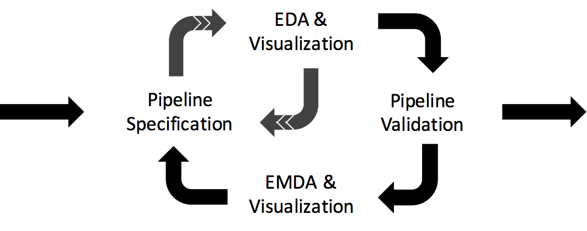
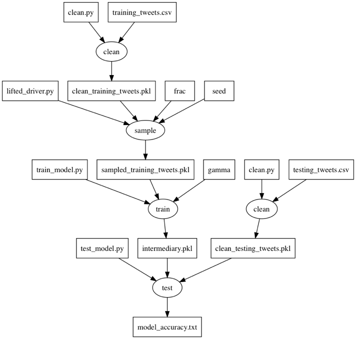

Jarvis
=====

Build, configure, and track workflows with Jarvis.

## What is Jarvis?
Jarvis is a system with a declarative DSL embedded in python for managing the workflow development phase of the machine learning lifecycle. Jarvis enables data scientists to describe ML workflows as directed acyclic graphs (DAGs) of *Actions* and *Artifacts*, and to experiment with different configurations by automatically running the workflow many times, varying the configuration. To date, Jarvis serves as a build system for producing some desired artifact, and serves as a versioning system that enables tracking the evolution of artifacts across multiple runs in support of reproducibility.

<p align="center">
  
</p>

## Example program
Contents of the `plate.py` file:
```python
import jarvis

jarvis.groundClient('git')
jarvis.jarvisFile('plate.py')

ones = jarvis.Literal([1, 2, 3], "ones")
ones.forEach()

tens = jarvis.Literal([10, 100], "tens")
tens.forEach()

@jarvis.func
def multiply(x, y):
z = x*y
print(z)
return z

doMultiply = jarvis.Action(multiply, [ones, tens])
product = jarvis.Artifact('product.txt', doMultiply)

product.pull()
product.plot()
```
On run produces:
```shell
10
20
30
100
200
300
```

## Motivation
Jarvis should facilitate the development of auditable, reproducible, justifiable, and reusable data science workflows. Is the data scientist building the right thing? We want to encourage discipline and best practices in ML workflow development by making dependencies explicit, while improving the productivity of adopters by automating multiple runs of the workflow under different configurations. The motivation for Jarvis has been explained as porting software engineering practices to machine learning. Data scientists should not be training models on default hyper-parameters merely because of convenience: what are the assumptions that justify the choice of hyper-parameters? Is the choice of ML model justified given the distribution of the data? Jarvis should also provide lineage information so developers can understand why a model behaved the way that it did, in cases of failure or exceptional performance: what were they hyper-parameters and scripts that led to a high classification accuracy in production?

## Challenges
* **Running the workflow many times, varying the configuration**:  The Jarvis workflow specification language is declarative, and we wanted to maintain this declarativity even when describing parallel and iterative computation. It's likely that a data scientist will want to run some workflow for each value of a hyper-parameter, say gamma, in some range. Jarvis supports this by wrapping that range in a *Literal*, and calling the `forEach()` method on that *Literal*. Then, when that literal is a dependency to some *Action*, Jarvis will run the workflow many times by iterating in parallel over the values in the list wrapped by that literal. When there are many such literals, the number of computations is the cross product of those literals. Keeping the execution environments of these workflows, with filesystem dependencies, isolated, when running in parallel, was a challenge. Reducing the amount of computation by re-using identical artifacts across parallel workflow executions, respecting isolation, is another foreseeable challenge.

* **Coherent types**: Before the introduction of Jarvis *Literals*, the types of objects in a Jarvis workflow were straightforward. There were only Actions and Artifacts. After the introduction of *Literals*, with the added feature for specifying parallel and iterative computation declaratively, the typing was complicated: is a Jarvis Action that depends on an iterable array of configurations a single action or many actions? What about the downstream artifacts this action produces: are they one artifact or many? We are still in the process of working through this added complication. Some alternatives to explore are python type annotations, or a formal specification of the types in the documentation.'

* **Adding features without bloating the object model**: Our goal is for the Jarvis workflow specification language to be simple and expressive, but often simplicity and expressivity are at odds with each other. Throughout the development of Jarvis, we added classes to `Fork`, `Sample`, `Split`, and had other classes in mind. These classes were in some ways hybrids of Jarvis *Actions* and *Artifacts*. The motivation behind them was to natively support common Machine Learning patterns, but we noticed that the introduction of these classes soon made the Jarvis types unintelligible. Thus, we removed these classes, and found that the introduction of a *Literal* was sufficient to express parallel and iterative computation, without unduly complicating the object types. This simplicity comes at the cost of the programmer having to write their own algorithms for common Machine Learning patterns. We hope to reduce this cost by writing libraries on top of Jarvis: if we can explain the higher level functionality in terms of Jarvis *Actions*, *Artifacts*, and *Literals*, it may be possible to boost productivity without compromising simplicity.

* [Pending] **Live monitoring and interruption during validation**: The workflow validation stage is the stage during which Jarvis will run many, possibly time consuming, trials to establish the reliability or trustworthiness of the workflow, and enable the data scientist to know which workflow configurations they should use. Because the workflow validation stage is expected to have a long duration, it is important to offer the data scientist tools to monitor the live behavior of the experiments, and control or interrupt the execution to save time and computing resources, or guide the search in better directions. TensorBoard is a promising system for these purposes, and our first attempt will be to integrate it with Jarvis and extend it the best we can before trying other systems or implementing our own.

* [Pending] **Incremental Computation**:  Different trials for the same experiment differ only in their configuration, and the same experiment as it evolves in time has pieces we can reuse. At a minimum, we will support *make* style incremental computation: we will use the timestamps of downstream artifacts to determine whether to run that action. However, there are non-functional alterations to code that change the timestamp but don't justify re-execution of a subgraph in the workflow: for example, adding a comment in the code. Being able to determine *semantic change* in an efficient manner is a foreseeable challenge. Additionally, we will need to think of change in terms of data as well as code. Determining whether data artifacts have changed, and to what extent, is another foreseeable challenge.

* [Pending] **Interactive environment support**: Data scientists in the wild use interactive environments such as Jupyter Notebooks. As a workflow development system, Jarvis should support the creative design and discovery of data science workflows. This process will necessarily involve real-time feedback and support for user interaction. Thus, we have numerous reasons to support interactive environments. However, interactive environments pose challenges for reproducibility, since the cells can be executed non-linearly. Supporting interactivity without compromising versioning and reproducibility is another foreseeable challenge. 

## Approach
### Simple and Expressive Object Model
The Jarvis object model consists exclusively of *Actions*, *Artifacts*, and *Literals*, that are connected to form dataflow graphs. Our goal is for Jarvis to be expressive enough to describe any data science workflow. We believe this set of classes, together with an Aggregation class that is pending implementation, is sufficient to express any data science workflow that can be written in Python; however, it's possible that we may need to change how these classes are parameterized to enable data scientists to control, for example, a Neural Network's architecture from Jarvis. We currently base this belief on intuitive appeal and accumulating evidence: it's hard to imagine a workflow that needs more than instructions or data, and a small team of undergraduate students has been able to translate machine learning workflows from their courses into Jarvis successfully. We will explore formal techniques for establishing the expressivity of Jarvis. We care about simplicity as it is perceived by the user, we would like for our object model to naturally match user's mental models of data science workflows. Usability studies will be necessary to determine whether users can naturally think and work with data science workflows with the Jarvis object model.

The Jarvis dataflow graph model is defined as follows:
* 3 distinguished node types: *Actions*, *Artifacts*, and *Literals*.
* Edges denote dataflow: consumption (from Artifact/Literal to Action) and production (from Action to Artifact).
* An Artifact can only have an edge to an Action.
* An Action can only have an edge to an Artifact.
* A Literal can only have an edge to an Action.
* Every Action must have some edge to an Artifact.

### Data-Centric Workflows
How are machine learning applications different from other applications? The main difference is data. Machine learning applications have data dependencies that obscure traiditional abstraction boundaries, and complicate the use of standard software engineering practices and tools. Moreover, data itself is in many ways fundamentally different from code artifacts which are front-and-center in major software projects. One dimension of difference is scale: it is not unusual for data files to be larger than several gigabytes. Even Github requires us to use Git LFS to version data artifacts. Another way in which data differs from code is in what counts as meaningful difference, or change. It is possible to get a sense for the similarity of two files, with a diff-style line by line comparison. This same technique would be ineffective when comparing two tables, since we usually care about whether they are instances of the same schema, or whether the points are sampled from the same distribution, rather than whether they contain exactly the same records. Unlike code, data is not something we should edit directly. Furthermore, we usually cannot skim data in plain text form, we must use visualization techniques to enable exploratory analysis, and to help us understand our data.

In Jarvis, data is a first-class citizen. Data is represented as an *Artifact* in Jarvis, and no *Action* runs unless it is to produce some *Artifact* the user requested. Jarvis will include built-in features to pre-process, visualize, version, and describe data by manipulating Artifacts, without making irreversibly modifications to the data. Additionally, dataflow is implicit in the edges that connect the Jarvis workflow (a graph).

### Artifact Versioning
Jarvis uses git to automatically version every (data, code, etc.) Artifact in a Jarvis workflow. After executing some workflow, and producing all the intermediary Artifacts, Jarvis uses a global list of pre-existing Artifacts it accessed and intermediary Artifacts that were generated during the execution to move these files to a separate directory (this directory is a git repo) called `jarvis.d`, and then commits the repository. Jarvis commits the `jarvis.d` repository after every run of a workflow. We refer to one run of a workflow as an 'experiment'. Sometimes, an experiment runs the same workflow many times, varying only the configuration parameters (controlled via Jarvis *Literals*). We refer to one executed configuration of a workflow as a 'trial'. Every trial is part of some experiment. Every experiment has at least one trial, but it can have many trials.  

The `jarvis.d` repository has the following location and structure:
1. By default, it is located in `~/jarvis.d`, in the filesystem of the localhost. The location of this directory can be changed by modifying a global variable in Jarvis, or (pending) will be set by setting an environment flag. `jarvis.d` is analogous to a lab journal, it tracks and stores multiple experiments.
2. Inside the `jarvis.d` directory is a list of folders. Each folder corresponds to one experiment. The naming convention is `(name of the experiment definition file)_(timestamp)`.
3. Inside each experiment folder is a list of folders. Each folder corresponds to one trial.
4. Inside each trial folder is a full copy of the files and folders in the directory where the Jarvis workflow specification file was run from, and all of the intermediary artifacts produced by running that trial. The metadata is stored in json files.

It is our plan to support moving a user's local instance of Jarvis to the cloud, so we will be adding support for pushing the `jarvis.d` repository to an online repository, and making its location and service available to other Jarvis components that depend on versioning.

### Artifact Contextualization

Jarvis uses [Ground](http://www.ground-context.org/) to store data about the context of *Artifacts*. Artifacts have a temporal context: they evolve over time. One example is a script being improved by a developer over time. Artifacts have provenance: they originate from other Artifacts together with the Actions that transform them. This provenance, or lineage, of an Artifact is captured in the Jarvis workflow specification, and is then communicated to the Ground service. Suppose you witness a drop in model accuracy, an Artifact, and you want to perform a root cause analysis: you'll need to know which versions of the data and code produced that Artifact, and then look for errors there. Jarvis, with Ground, will capture all the relevant metadata to answer questions such as: which configuration of gamma gave me the best model accuracy? When a user wishes to materialize a past experiment, they'll use information stored in Ground to find the version of the experiment they need. Jarvis will also log and track configuration parameters with the ideal that no experiment is ever unknowingly run twice. Jarvis will be able to answer questions such as, what was the model accuracy for this configuration? Storing Artifact context will also be essential for reproducibility, because it enables not only materializing past versions, but also informs the user about which version to materialize. Ground and git are complementary services used by Jarvis.

### Parallel Multi-Trial Experiments

We hope that Jarvis will enable data scientists to try more ideas quickly. For this, we need to enhance speed of execution, and therefore levarage [Ray](https://github.com/ray-project/ray) to execute multiple trials in parallel. Although trials can be run independently, often times there will be a number of Artifacts that are the same across all trials, yielding an opportunity for caching and re-use. Jarvis will also need to support execution in remote distributed systems, and have a way to centralize all the artifacts for versioning and reproducibility. Another opportunity for parallelization is within-trial: many times, data science workflows will contain independent branches that may be run in parallel. We will explore whether Ray is the right architecture to manage nested parallelization.

### Visualization and Exploratory Data Analysis

In order to establish the fitness of data for some particular purpose, or gain valuable insights about charactersitics of the data, it will be useful to levarage visualization techniques in an interactive environment such as Jupyter Notebook. Visualizations can help the data scientist learn which features to use, pre-processing algorithms to apply to correct for outliers, skew, or missing data, and so on. During the more time-intesive stage of workflow validation, visualization can be used to give the data scientist a sense of, for example, how efficiently the model is learnig from the data and whether further tuning is necessary. 

<p align="center">
  
</p>

We also use visualization for its ability to give immediate feedback and guide the creative process. One common example is the previewing mechanism of Jupyter. We would like to enhance this so that the workflow graph is illustrated on-the-fly, and the user interact with either the code or the diagram to specify the workflow. Currently, we use GraphViz by calling `plot()` on some Artifact to visualize the graph rooted at that Artifact (see figure above). 

## License
Jarvis is licensed under the [Apache v2 License](https://www.apache.org/licenses/LICENSE-2.0).
