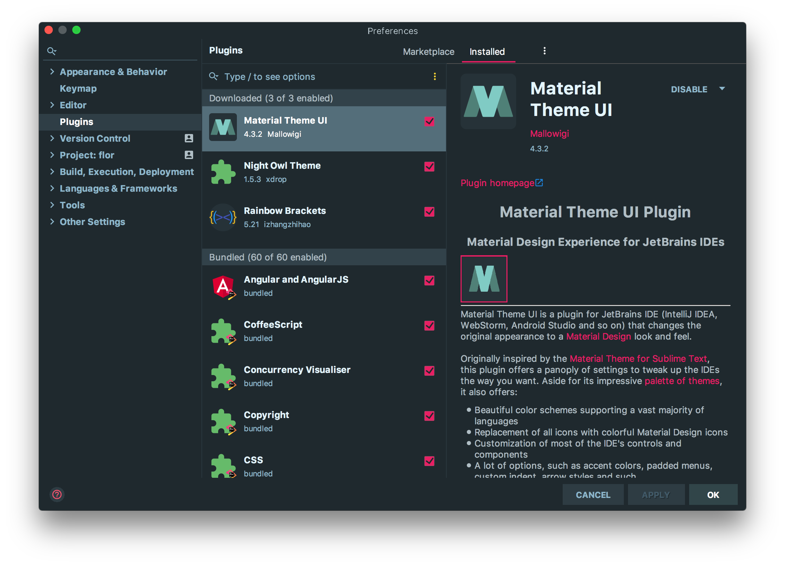
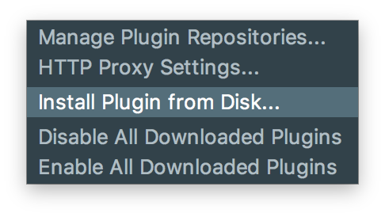
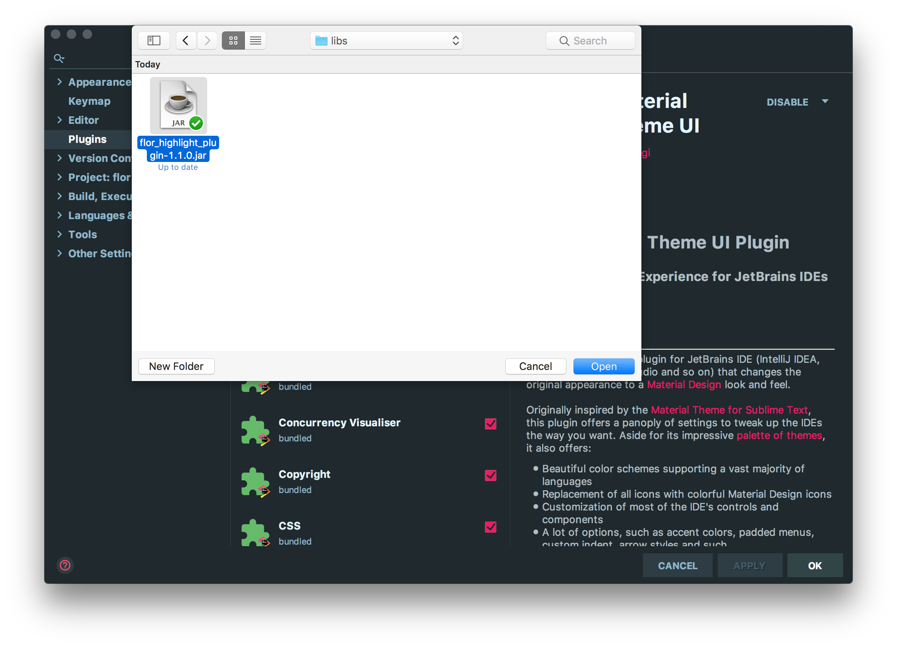
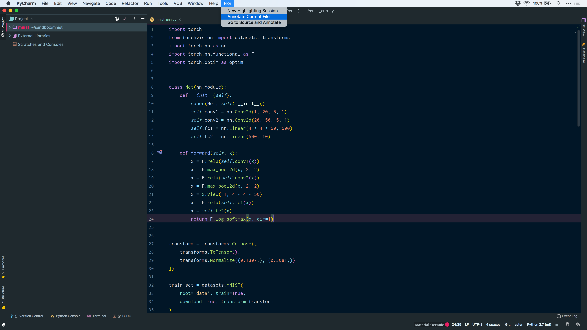
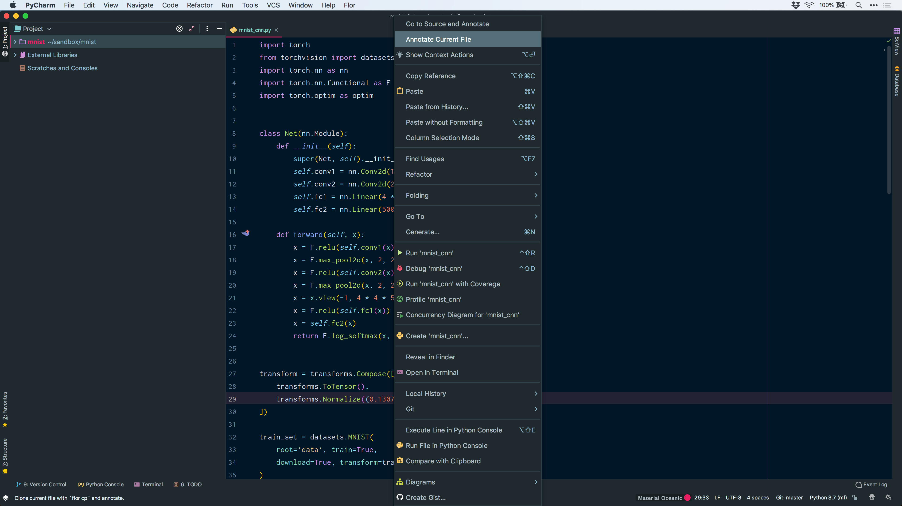
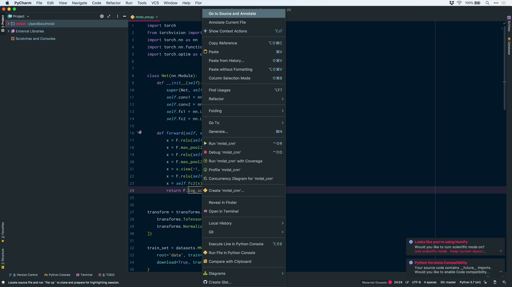
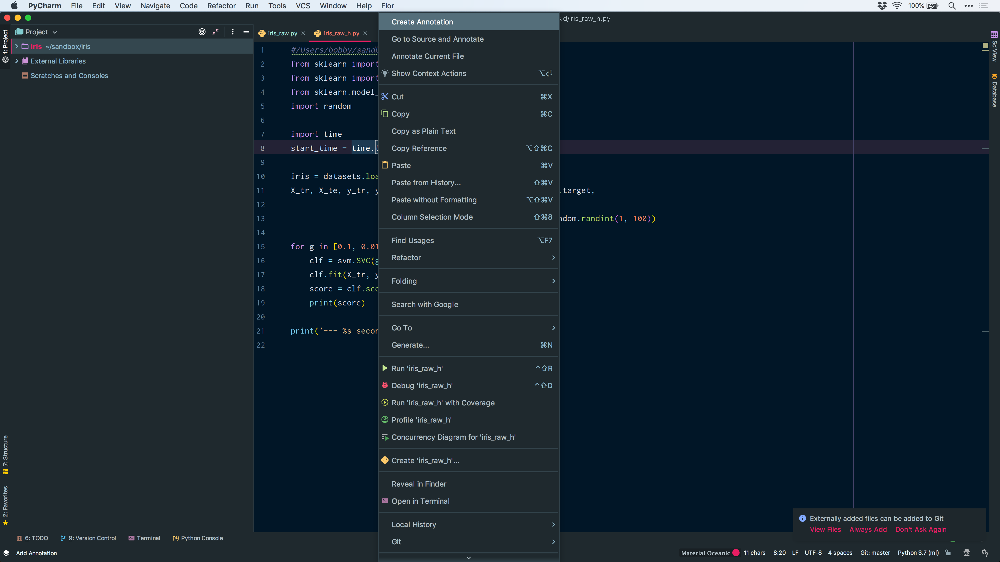

# Flor Highlight Plugin for PyCharm and Intellij IDEA

This plugin provides support for Flor highlight and annotations in PyCharm, or IntelliJ IDEA (with the Python plugin installed).

## Requirements

- PyCharm or IntelliJ IDEA 2017.3+
- [Python plugin](https://plugins.jetbrains.com/plugin/631-python) (required for IntelliJ IDEA only)

## Installation

- Download the latest release `.jar` file from `build/libs/`

- Open *Settings* or *Preferences* in PyCharm

  

- Click the three vertical dots to open the dropdown menu, and select *Install Plugin from Disk…*

  

- Locate and open the the `.jar` file

	
	
- Restart the IDE

## Usage

#### Annotating Current File

- Start annotating the current file that is open in the editor either by going to *Flor* > *Annotate Current File*, or *Right Click* > *Annotate Current File*.

	

	

#### Annotating Source Files

- Place the caret at the method whose source file you'd like to annotate, or make a selection of the method name with the caret.
- Start annotating the source file either by going to *Flor* > *Go to Source and Annotate*, or *Right Click* > *Go to Source and Annotate*.

	

#### Creating Annotations

- Select or place the caret at the expression you wish to annotate

- *Right Click* or *Ctrl* + *Click* > *Create Annotation*

  

- Enter a name/label and hit *Return* or Click *OK*