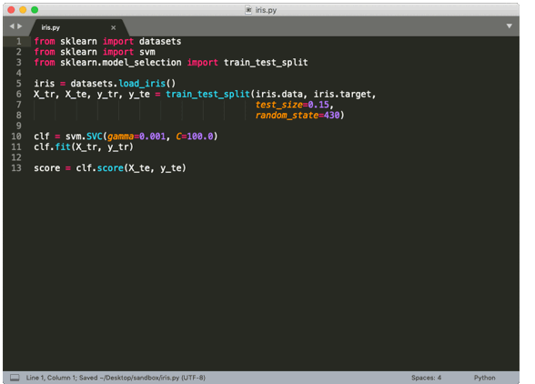

Flor
====

Flor_ is an easy to use logger and automatic version controller made for data scientists who write ML code.
It helps you understand what alternatives you've tried, and with what results.
It alleviates the burden of tracking the data, code, and parameters used to train a model,
and associating such metadata with the model's metrics, for each execution.
Flor_ automatically tracks this context on every execution so your changes are **reversible** and **redo-able** --
you can focus on exploration and composition.

Example Use
-----------

In the animation below, we show you how to wrap the classic scikit-learn
`iris example <https://scikit-learn.org/stable/tutorial/basic/tutorial.html>` in Flor.

For reference, we've transformed this code...

.. code-block:: python

    from sklearn import datasets
    from sklearn import svm
    from sklearn.model_selection import train_test_split

    iris = datasets.load_iris()
    X_tr, X_te, y_tr, y_te = train_test_split(iris.data, iris.target,
                                              test_size=0.15,
                                              random_state=430)

    clf = svm.SVC(gamma=0.001, C=100.0)
    clf.fit(X_tr, y_tr)

    score = clf.score(X_te, y_te)

... to this code:

.. code-block:: python

    from sklearn import datasets
    from sklearn import svm
    from sklearn.model_selection import train_test_split
    import flor

    log = flor.log

    @flor.track
    def fit_and_score_model():
        iris = datasets.load_iris()
        X_tr, X_te, y_tr, y_te = train_test_split(iris.data, iris.target,
                                                  test_size=log.param(0.15),
                                                  random_state=log.param(430))

        clf = svm.SVC(gamma=log.param(0.001), C=(100.0))
        clf.fit(X_tr, y_tr)

        score = log.metric(clf.score(X_te, y_te))

    with flor.Context('iris'):
        fit_and_score_model()

... to produce these logs:

.. code-block:: json

    {
        "block_type": "function_body :: fit_and_score_model",
        "log_sequence": [
            {
                "assignee": [
                    "X_tr",
                    "X_te",
                    "y_tr",
                    "y_te"
                ],
                "caller": "train_test_split",
                "from_arg": false,
                "in_execution": "fit_and_score_model",
                "in_file": "/Users/rogarcia/Desktop/sandbox/iris.py",
                "instruction_no": 11,
                "keyword_name": "test_size",
                "pos": null,
                "runtime_value": 0.15,
                "typ": "param",
                "value": "0.15"
            },
            {
                "assignee": [
                    "X_tr",
                    "X_te",
                    "y_tr",
                    "y_te"
                ],
                "caller": "train_test_split",
                "from_arg": false,
                "in_execution": "fit_and_score_model",
                "in_file": "/Users/rogarcia/Desktop/sandbox/iris.py",
                "instruction_no": 11,
                "keyword_name": "random_state",
                "pos": null,
                "runtime_value": 430,
                "typ": "param",
                "value": "430"
            },
            {
                "assignee": "clf",
                "caller": "svm.SVC",
                "from_arg": false,
                "in_execution": "fit_and_score_model",
                "in_file": "/Users/rogarcia/Desktop/sandbox/iris.py",
                "instruction_no": 15,
                "keyword_name": "gamma",
                "pos": null,
                "runtime_value": 0.001,
                "typ": "param",
                "value": "0.001"
            },
            {
                "assignee": "score",
                "caller": null,
                "from_arg": false,
                "in_execution": "fit_and_score_model",
                "in_file": "/Users/rogarcia/Desktop/sandbox/iris.py",
                "instruction_no": 18,
                "keyword_name": null,
                "pos": null,
                "runtime_value": 1.0,
                "typ": "metric",
                "value": "clf.score(X_te, y_te)"
            }
        ]
    }

License
-------

Flor is Licensed under the `Apache V2 License`__.

__ https://www.apache.org/licenses/LICENSE-2.0

.. _Flor: https://github.com/ucbrise/flor

.. toctree::
    :maxdepth: 1
    :caption: Installation

    install.rst

.. toctree::
    :maxdepth: 1
    :caption: Getting Started

    api.rst
    log_cfg.rst

.. toctree::
    :maxdepth: 1
    :caption: Help

    support.rst
